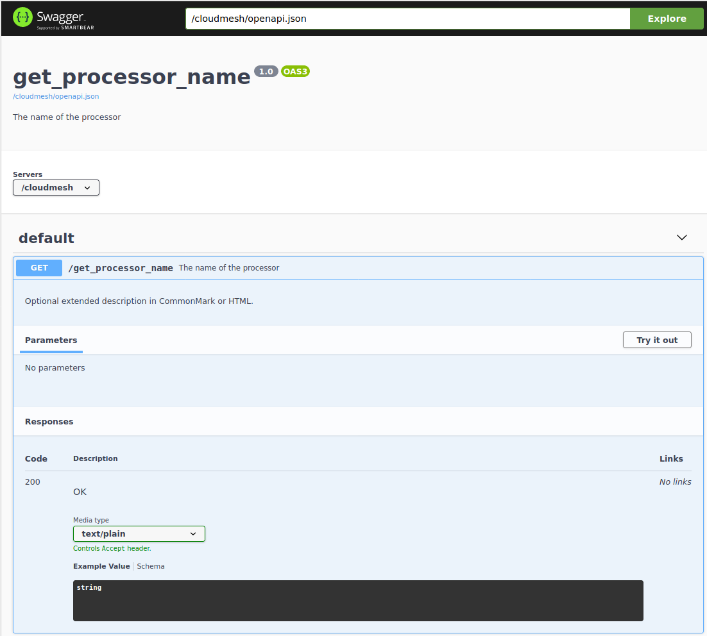
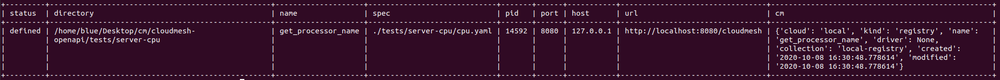

# Cloudmesh OpenAPI Service Generator


> **Note:** The README.md page is outomatically generated, do not edit it.
> To modify  change the content in
> <https://github.com/cloudmesh/cloudmesh-openapi/blob/main/README-source.md>
> Curley brackets must use two in README-source.md


[](https://pypi.org/project/cloudmesh-openapi/)
[](https://pypi.python.org/pypi/cloudmesh-openapi)
[](https://github.com/cloudmesh/cloudmesh-openapi/blob/main/LICENSE)
[](https://pypi.python.org/pypi/cloudmesh-openapi)
[](https://pypi.python.org/pypi/cloudmesh-openapi)
[](https://travis-ci.com/cloudmesh/cloudmesh-openapi)

## Publication

A draft paper is available at

* <https://github.com/laszewski/laszewski.github.io/raw/master/papers/vonLaszewski-openapi.pdf>

The source to the paper is at

* <https://github.com/cyberaide/paper-openapi>

## Prerequisites

* We recommend Python 3.8.2 Python or newer.
* We recommend pip version 20.0.2 or newer
* We recommend that you use a venv (see developer install)
* MongoDB installed as regular program not as service, which can
  easily be done with cloudmesh on macOS, Linux, and Windows.
* Please run `cms gui quick` to initialize the password for the mongodb
  server

> Note: On windows you can use [gitbash](https://gitforwindows.org/)
> so you can use bash and can use the same commands as on Linux or
> macOS. Otherwise, please use the appropriate backslashes to access
> the path.

## Installation

The installation is rather simple  and is documented next.

```
python -m venv ~/ENV3
source ~/ENV3/bin/activate 
mkdir cm
cd cm
pip install cloudmesh-installer
cloudmesh-installer get openapi 
cms help
cms gui quick
# fill out mongo variables
# make sure autinstall is True
cms config set cloudmesh.data.mongo.MONGO_AUTOINSTALL=True
cms admin mongo install --force
# Restart a new terminal to make sure mongod is in your path
cms init
```

If you like to know more about the installation of cloudmesh, please
visit the [Cloudmesh
Manual](https://cloudmesh.github.io/cloudmesh-manual/installation/install.html).

## Command Overview

When getting started using cloudmes `openapi`, please first call to
get familiar with the options you have:

```
cms help openapi
```

We include the manual page later on in this document.

## Quick Start

Next we provide a very simple quickstart guide to steps to generate a
simple microservice that returns the CPU information of your computer.
We demonstrate how to generate, start, and stop the servive.

Navigate to `~/cm/cloudmesh-openapi` folder. In this folder you will
have a file called `cpu.py` from which we will generate the server.

First, generate an OpenAPI YAML file with the convenient command

```
cms openapi generate get_processor_name \
    --filename=./tests/server-cpu/cpu.py
```

This will create the file `cpu.yaml` that contains the OpenAPI
specification. To start the service from this specification simply use
the command

```
cms openapi server start ./tests/server-cpu/cpu.yaml
```

Now that the service is up and running, you can issue a request for
example via the commandline with

```
curl -X GET "http://localhost:8080/cloudmesh/get_processor_name" \
     -H "accept: text/plain"
```

To view the automatically generated documentation, you can go to your
browser and open the link

* <http://localhost:8080/cloudmesh/ui>



You can also look at the status of the server with the command

```
cms openapi server list
```




Once yo no longer need the service, you can stop it with 

```
cms openapi server stop cpu
```

## Quickstart to Creating your own Microservice

Cloudmesh uses introspection to generate an OpenAPI compliant YAML
specification that will allow your Python code to run as a web
service. For this reason, any code you write must conform to a set of
guidelines.

- The parameters and return values of any functions you write must use
  python typing
- Your functions must include docstrings
- If a function uses or returns a class, that class must be defined as
  a dataclass in the same file

Next we demonstrate how to create your own microservice. 
We provide two examples. One in which we return a float, 
te other one in which the return value is wrapped in a 
json object.

### Returning a Float

We define a function that adds tow values.  Note how x,
y, and the return value are all typed. In this case they are all
`float`, but other types are supported. The description in the
docstring will be added to your YAML specification to help describe
what the function does.

```
def add(x: float, y: float) -> float:
    """
    adding float and float.
    :param x: x value
    :type x: float
    :param y: y value
    :type y: float
    :return: result
    :return type: float
    """
    result = x + y

    return result
```

To generate, start, retrieve a result, and stop the service you can use the 
following command sequence:

```
cms openapi generate add --filename=./tests/add-float/add.py
cms openapi server start ./tests/add-float/add.yaml 
curl -X GET "http://localhost:8080/cloudmesh/add?x=1&y=2" -H  "accept: text/plain"
# This command returns
> 3.0
cms openapi server stop add
```

### Returning a Json Object

Often we like to wrap the return value into a json string object, which can easily be 
done by modifying the previous example as showcased next.

```
from flask import jsonify

def add(x: float, y: float) -> str:
    """
    adding float and float.
    :param x: x value
    :type x: float
    :param y: y value
    :type y: float
    :return: result
    :return type: float
    """
    result = {"result": x + y}

    return jsonify(result)
```

To generate, start, retrieve a result, and stop the service you can use the 
following command sequence:

```
cms openapi generate add --filename=./tests/add-json/add.py
cms openapi server start ./tests/add-json/add.yaml 
curl -X GET "http://localhost:8080/cloudmesh/add?x=1&y=2" -H  "accept: text/plain"
# This command returns
> {"result":3.0}
cms openapi server stop add
``` 

As usual in both cases the web browser can be used to inspect the documentation as well as to test running the 
example, by filling out the form. 

## Details of the `cms openapi` command

The gaol as stated earlier is to transform a simple python function as a service

### Generating OpenAPI specification

Once you have a Python function you would like to deploy as a web
service, you can generate the OpenAPI specification. Navigate to your
.py file's directory and generate the YAML. This will print
information to your console about the YAML file that was generated.

```
cms openapi generate [function_name] --filename=[filename.py]
```

If you would like to include more than one function in your web
service, like addition and subtraction, use the `--all_functions`
flag. This will ignore functions whose names start with '\_'.

```
cms openapi generate --filename=[filename.py] --all_functions
```

You can even write a class like Calculator that contains functions for
addition, subtraction, etc. You can generate a specification for an
entire class by using the `--import_class` flag.

```
cms openapi generate [ClassName] --filename=[filename.py] --import_class
```

### Starting a server

Once you have generated a specification, you can start the web service
on your localhost by providing the path to the YAML file. This will
print information to your console about the server

```
cms openapi server start ./[filename.yaml]

  Starting: [server name]
  PID:      [PID]
  Spec:     ./[filename.py]
  URL:      http://localhost:8080/cloudmesh
  Cloudmesh UI:      http://localhost:8080/cloudmesh/ui
```      

### Sending requests to the server

Now you have two options to interact with the web service. The first
is to navigate the the Cloudmesh UI and click on each endpoint to test
the functionality. The second is to use curl commands to submit
requests.

We have already shown you earlier in our quickstart how to apply this to a 
service such as our add service

```
$ curl -X GET "http://localhost:8080/cloudmesh/add?x=1.2&y=1.5" -H "accept: text/plain"
>   2.7
```

### Stopping the server

Now you can stop the server using the name of the server. If you
forgot the name, use `cms openapi server ps` to get a list of server
processes.

```
$ cms openapi server stop [server name]
```

### Basic Auth

To use basic http authentication with a user password for the
generated API, add the following flag at the end of a `cms openapi
generate` command:

```
--basic_auth=<username>:<password>
```

We plan on supporting more security features in the future. Example:

```
cms openapi generate get_processor_name \
    --filename=./tests/server-cpu/cpu.py \
    --basic_auth=admin:secret
```

## Manual Page

```
openapi generate [FUNCTION] --filename=FILENAME
                         [--serverurl=SERVERURL]
                         [--yamlfile=YAML]
                         [--import_class]
                         [--all_functions]
                         [--enable_upload]
                         [--verbose]
                         [--basic_auth=CREDENTIALS]
openapi server start YAML [NAME]
              [--directory=DIRECTORY]
              [--port=PORT]
              [--server=SERVER]
              [--host=HOST]
              [--verbose]
              [--debug]
              [--fg]
              [--os]
openapi server stop NAME
openapi server list [NAME] [--output=OUTPUT]
openapi server ps [NAME] [--output=OUTPUT]
openapi register add NAME ENDPOINT
openapi register filename NAME
openapi register delete NAME
openapi register list [NAME] [--output=OUTPUT]
openapi TODO merge [SERVICES...] [--dir=DIR] [--verbose]
openapi TODO doc FILE --format=(txt|md)[--indent=INDENT]
openapi TODO doc [SERVICES...] [--dir=DIR]
openapi sklearn FUNCTION MODELTAG
openapi sklearnreadfile FUNCTION MODELTAG
openapi sklearn upload --filename=FILENAME

Arguments:
  FUNCTION  The name for the function or class
  MODELTAG  The arbirtary name choosen by the user to store the Sklearn trained model as Pickle object
  FILENAME  Path to python file containing the function or class
  SERVERURL OpenAPI server URL Default: https://localhost:8080/cloudmesh
  YAML      Path to yaml file that will contain OpenAPI spec. Default: FILENAME with .py replaced by .yaml
  DIR       The directory of the specifications
  FILE      The specification

Options:
  --import_class         FUNCTION is a required class name instead of an optional function name
  --all_functions        Generate OpenAPI spec for all functions in FILENAME
  --debug                Use the server in debug mode
  --verbose              Specifies to run in debug mode
                         [default: False]
  --port=PORT            The port for the server [default: 8080]
  --directory=DIRECTORY  The directory in which the server is run
  --server=SERVER        The server [default: flask]
  --output=OUTPUT        The outputformat, table, csv, yaml, json
                         [default: table]
  --srcdir=SRCDIR        The directory of the specifications
  --destdir=DESTDIR      The directory where the generated code
                         is placed

Description:
This command does some useful things.

openapi TODO doc FILE --format=(txt|md|rst) [--indent=INDENT]
    Sometimes it is useful to generate teh openaopi documentation
    in another format. We provide fucntionality to generate the
    documentation from the yaml file in a different formt.

openapi TODO doc --format=(txt|md|rst) [SERVICES...]
    Creates a short documentation from services registered in the
    registry.

openapi TODO merge [SERVICES...] [--dir=DIR] [--verbose]
    Merges tow service specifications into a single servoce
    TODO: do we have a prototype of this?


openapi sklearn sklearn.linear_model.LogisticRegression
    Generates the .py file for the Model given for the generator

openapi sklearnreadfile sklearn.linear_model.LogisticRegression
Generates the .py file for the Model given for the generator which supports reading files

openapi generate [FUNCTION] --filename=FILENAME
                             [--serverurl=SERVERURL]
                             [--yamlfile=YAML]
                             [--import_class]
                             [--all_functions]
                             [--enable_upload]
                             [--verbose]
                             [--basic_auth=CREDENTIALS]
    Generates an OpenAPI specification for FUNCTION in FILENAME and
    writes the result to YAML. Use --import_class to import a class
    with its associated class methods, or use --all_functions to 
    import all functions in FILENAME. These options ignore functions
    whose names start with '_'. Use --enable_upload to add file
    upload functionality to a copy of your python file and the
    resulting yaml file.

    For optional basic authorization, we support (temporarily) a single user
    credential. CREDENTIALS should be formatted as follows:

    user:password

    Example: --basic_auth=admin:secret

openapi server start YAML [NAME]
                  [--directory=DIRECTORY]
                  [--port=PORT]
                  [--server=SERVER]
                  [--host=HOST]
                  [--verbose]
                  [--debug]
                  [--fg]
                  [--os]
    starts an openapi web service using YAML as a specification
    TODO: directory is hard coded as None, and in server.py it
      defaults to the directory where the yaml file lives. Can
      we just remove this argument?

openapi server stop NAME
    stops the openapi service with the given name
    TODO: where does this command has to be started from

openapi server list [NAME] [--output=OUTPUT]
    Provides a list of all OpenAPI services in the registry

openapi server ps [NAME] [--output=OUTPUT]
    list the running openapi service

openapi register add NAME ENDPOINT
    Openapi comes with a service registry in which we can register
    openapi services.

openapi register filename NAME
    In case you have a yaml file the openapi service can also be
    registerd from a yaml file

openapi register delete NAME
    Deletes the names service from the registry

openapi register list [NAME] [--output=OUTPUT]
    Provides a list of all registerd OpenAPI services
```


## Basic Examples

Please follow [Pytest Information](tests/README.md) document for
pytests related information

We have included a significant number of tests that aso serve as examples

### Example: One function in a python file

1. Please check [Python file](tests/server-cpu/cpu.py).

2. Run below command to generate yaml file and start server

   ```
   cms openapi generate get_processor_name --filename=./tests/server-cpu/cpu.py
   ```

### Example: Multiple functions in python file

1. Please check [Python file](tests/generator-calculator/calculator.py)

2. Run below command to generate yaml file and start server

   ```
   cms openapi generate --filename=./tests/generator-calculator/calculator.py --all_functions
   cms openapi generate server start ./tests/generator-calculator/calculator.py
   ```

### Example: Function(s) in python class file

1. Please check [Python file](tests/generator-testclass/calculator.py)

2. Run below command to generate yaml file and start server

   ```
   cms openapi generate Calculator \
       --filename=./tests/generator-testclass/calculator.py \
       --import_class"
   cms openapi server start ./tests/generator-testclass/calculator.yaml
   curl -X GET "http://localhost:8080/cloudmesh/Calculator/multiplyint?x=1&y=5"
   cms openapi server stop Calculator
   ```

### Example: Uploading data

Code to handle uploads is located in
`cloudmesh-openapi/tests/generator-upload`. The code snippet in
uploadexample.py and the specification in uploadexample.yaml can be
added to existing projects by adding the `--enable_upload` flag to the
`cms openapi generate` command. The web service will be able to
retrieve the uploaded file from `~/.cloudmesh/upload-file/`.

#### Upload example

This example shows how to upload a CSV file and how the web service
can retrieve it.

First, generate the OpenAPI specification and start the server

```
cms openapi generate print_csv2np \
    --filename=./tests/generator-upload/csv_reader.py \
    --enable_upload
cms openapi server start ./tests/generator-upload/csv_reader.yaml
```

Next, navigate to localhost:8080/cloudmesh/ui. Click to open
the /upload endpoint, then click 'Try it out.' Click to choose a file
to upload, then upload `tests/generator-upload/np_test.csv`. Click
'Execute' to complete the upload.

The uploaded file will be located at
`~/.cloudmesh/upload-file/[filename]`. The file
`tests/generator-upload/csv_reader.py` contains some example code to
retrieve the array in the uploaded file. To see this in action, click
to open the /print_csv2np endpoint, then click 'Try it out.' Enter
"np_test.csv" in the field that prompts for a filename, and then click
Execute to view the numpy array defined by the CSV file.

### Example: Pipeline Anova SVM Example

This example is based on the sklearn example
[here](https://scikit-learn.org/stable/auto_examples/feature_selection/plot_feature_selection_pipeline.html#sphx-glr-auto-examples-feature-selection-plot-feature-selection-pipeline-py)

In this example, we will upload a data set to the server, tell the
server to train the model, and utilize said model for predictions.

Firstly, ensure we are in the correct directory.

```
$ pwd
~/cm/cloudmesh-openapi
```

Then install some requirements needed for this example

```
$ pip install sklearn pandas
```

Let us generate the yaml file from our python file to generate the proper specs for our service.

```
$ cms openapi generate PipelineAnovaSVM \
      --filename=./tests/Scikitlearn-experimental/sklearn_svm.py \
      --import_class --enable_upload
```

Now let us start the server

```
$ cms openapi server start ./tests/Scikitlearn-experimental/sklearn_svm.yaml
```

The server should now be active. Navigate to
`http://localhost:8080/cloudmesh/ui`. We now have a nice user inteface
to interact with our newly generated API. Let us upload the data
set. We are going to use the iris data set in this example. We have
provided it for you to use. Simply navigate to the `/upload` endpoint
by clicking on it, then click `Try it out`.

We can now upload the file. Click on `Choose File` and upload the data
set located at `./tests/Scikitlearn-experimental/iris.data`.  Simply
hit `Execute` after the file is uploaded. We should then get a return
code of 200 (telling us that everything went ok).

The server now has our dataset. Let us now navigate to the `/train`
endpoint by, again, clicking on it. Similarly, click `Try it out`.
The parameter being asked for is the filename. The filename we are
interested in is `iris.data`. Then click `execute`.  We should get
another 200 return code with a Classification Report in the Response
Body.  

``` CLASSIFICATION_REPORT: precision recall f1-score support

           0       1.00      1.00      1.00         8
           1       0.85      1.00      0.92        11
           2       1.00      0.89      0.94        19

    accuracy                           0.95        38
   macro avg       0.95      0.96      0.95        38
weighted avg       0.96      0.95      0.95        38
```

Our model is now trained and stored on the server. Let us make a
prediction now. As we have done, navigate to the `/make_prediction`
endpoint.  The information we need to provide is the name of the model
we have trained as well as some test data. The name of the model will
be the same as the name of the data-file (ie. iris). So type in `iris`
into the `model_name` field. Finally for params, let us use the
example `5.1, 3.5, 1.4, 0.2` as the model expects 4 values
(attributes). After clicking execute, we should received a response
with the classification the model has made given the parameters.

The response received should be as follows:

```
"Classification: ['Iris-setosa']"
```

We can make as many predictions as we like. When finished, we can shut down the server.

```
$ cms openapi server stop sklearn_svm
```


## Example to Run AI Services in the Cloud 

### Google

After you create your google cloud account, it is recommended to
download and install Google's [Cloud
SDK](https://cloud.google.com/sdk/docs/quickstarts).  This will
enable CLI. Make sure you enable all the required services.

For example:

```
gcloud services enable servicemanagement.googleapis.com
gcloud services enable endpoints.googleapis.com
```

and any other services you might be using for your specific Cloud API
function.

To begin using the tests for any of the Google Cloud Platform AI
services you must first set up a Google account (set up a free tier
account): [Google Account
Setup](https://cloud.google.com/billing/docs/how-to/manage-billing-account)

After you create your google cloud account, it is recommended to
download and install Google's [Cloud
SDK](https://cloud.google.com/sdk/docs/quickstarts).  This will
enable CLI. Make sure you enable all the required services.

For example:

```
gcloud services enable servicemanagement.googleapis.com
gcloud services enable servicecontrol.googleapis.com
gcloud services enable endpoints.googleapis.com
```

and any other services you might be using for your specific Cloud API
function.

It is also required to install the cloudmesh-cloud package, if not
already installed:

```
cloudmesh-installer get cloud
cloudmesh-installer install cloud
```

This will allow you automatically fill out the cloudmesh yaml file
with your credentials once you generate the servcie account JSON file.

After you have verified your account is created you must then give your account access to the proper APIs and create a
 project in the Google Cloud Platform(GCP) console.
 
1. Go to the [project
   selector](console.cloud.google.com/projectselector2/home/)

2. Follow directions from Google to create a project linked to your
   account

### Quickstart Google Python API

```
pip install --upgrade google-api-python-client google-auth-httplib2 google-auth-oauthlib
```

* For quickstart in using Google API for Python visit [here](https://developers.google.com/docs/api/quickstart/python)

### Setting up your Google account

Before you generate the service account JSON file for your account you
will want to enable a number of services in the GCP console.

- Google Compute
- Billing
- Cloud Natural Language API
- Translate API

1. To do this you will need to click the menu icon in the Dashboard
   navigation bar. Ensure you are in the correct porject.

2. Once that menu is open hover over the "APIs and Services" menu item
   and click on "Dashboard" in the submenu.

3. At the dashboard click on the "+ Enable APIs and Services" button
   at the top of the dashboard

4. Search for **cloud natural language** to find the API in the search
   results and click the result

5. Once the page opens click "Enable"

6. Do the same for the **translate** API to enable that as well

7. Do the same for the **compute engine API** to enable that as well

You must now properly set up the account roles to ensure you will have
access to the API. Follow the directions from Google to [set up proper
authentication](https://cloud.google.com/natural-language/docs/setup#auth)

Make you account an owner for each of the APIs in the IAM tool as
directed in the authentication steps for the natural language API.
This makes your service account have proper access to the required
APIs and once the private key is downloaded those will be stored
there.

It is VERY important that you create a service account and download
the private key as described in the directions from Google.  If you do
not the cms google commands will not work properly.

Once you have properly set up your permissions please make sure you
download your JSON private key for the service account that has
permissions set up for the required API services. These steps to
download are found
[here](https://cloud.google.com/natural-language/docs/setup#sa-create).
Please take note of where you store the downloaded JSON and copy the
path string to a easily accessible location.


The client libraries for each API are included in teh requirements.txt file for the openapi proejct and should be isntalled when the
package is installed. If not, follow directions outlined by google install each package:

```
google-cloud-translate
google-cloud-language
```

To pass the information from your service account private key file ot
the cloudmesh yaml file run the following command:

```
cms register update --kind=google --service=compute --filename=GOOGLE_JSON_FILE
```

#### Running the Google Natural Language and Translate REST Services

1. Navigate to the `~/.cloudmesh` repo and create a cache directory
   for your text examples you would like to analyze.

   ```    
   mkdir text-cache
   ```    

2. Add any plain text files your would like to analyze to this
   directory with a name that has no special characters or spaces.
   You can copy the files at this location,
   `./cloudmesh-openapi/tests/textanaysis-example-text/reviews/` into
   the text-cache if you want to use provided examples.

3. Navigate to the `./cloudmesh-openapi` directory on your machine

4. Utilize the generate command to create the OpenAPI spec

   ```    
   cms openapi generate TextAnalysis --filename=./tests/generator-natural-lang/natural-lang-analysis.py --all_functions
   ```
     
5. Start the server after the yaml file is generated ot the same
   directory as the .py file
    
   ```    
   cms openapie start server ./tests/generator-natural-lang/natural-lang-analysis.yaml
   ```
   
6. Run a curl command against the newly running server to verify it
   returns a result as expected.

    * Sample text file name is only meant to be the name of the file
      not the full path.

      ```    
      curl -X GET "http://127.0.0.1:8080/cloudmesh/analyze?filename=SAMPLE_TEXT_FILENAME&cloud=google"
      ```
   
    * This is currently only ready to translate a single word through
      the API.
    
      ```    
      curl -X GET "http://127.0.0.1:8080/cloudmesh/translate_text?cloud=google&text=WORD_TO_TRANSLATE&lang=LANG_CODE"
      ``` 
7. Stop the server

   ```    
   cms openapi server stop natural-lang-analysis
   ```
### Example using AWS

Sign up for AWS

* Go to [https://portal.aws.amazon.com/billing/signup](https://portal.aws.amazon.com/billing/signup)
* Follow online instructions

Create an IAM User

* For instructions, see 
[here](https://docs.aws.amazon.com/IAM/latest/UserGuide/getting-started_create-admin-group.html)

Set up AWS CLI and AWS SDKs

* To download and instructions to install AWS CLI, see
  [here](https://docs.aws.amazon.com/cli/latest/userguide/cli-chap-install)

Install Boto 3

```
pip install boto3
```

* For quickstart, vist [here](https://boto3.amazonaws.com/v1/documentation/api/latest/guide/quickstart.html)

As long as you enable all the services you need for using AWS AI APIs you should be able to write your functions for OpenAPI


### Example using Azure


#### Setting up Azure Sentiment Analysis and Translation Services

1.  Create an Azure subscription. If you do not have one, create a
    [free account](https://azure.microsoft.com/try/cognitive-services/)

2. Create a [Text Analysis resource](https://portal.azure.com/#create/Microsoft.CognitiveServicesTextAnalytics)

    * This link will require you to be logged in to the Azure portal
    
3. Create a [Translation Resource](https://docs.microsoft.com/en-us/azure/cognitive-services/cognitive-services-apis-create-account?tabs=multiservice%2Cwindows)

4. The microsoft packages are included in the openapi package
   requirements file so they should be installed. If they are not,
   install the following:

   ```
   pip install msrest 
   pip install azure-ai-textanalytics
   ```
   
5. Navigate to the `~/.cloudmesh` repo and create a cache directory for your text examples you would like to analyze.

   ```    
   mkdir text-cache
   ```
      
6. Add any plain text files your would like to analyze to this
   directory with a name that has no special characters or spaces.
   You can copy the files at this location,
   `./cloudmesh-openapi/tests/textanaysis-example-text/reviews/` into
   the text-cache if you want to use provided examples.

7. Navigate to the `./cloudmesh-openapi` directory on your machine

8. Utilize the generate command to create the OpenAPI spec

   ```
   cms openapi generate TextAnalysis --filename=./tests/generator-natural-lang/natural-lang-analysis.py --all_functions
   ```
    
9. Start the server after the yaml file is generated ot the same
   directory as the .py file
    
   ```    
   cms openapie start server ./tests/generator-natural-lang/natural-lang-analysis.yaml
   ```
     
10. Run a curl command against the newly running server to verify it
    returns a result as expected.

    * Sample text file name is only meant to be the name of the file not the full path.

      ```    
      curl -X GET "http://127.0.0.1:8080/cloudmesh/analyze?filename=<<sample text file name>>&cloud=azure"
      ```
      
    * This is currently only ready to translate a single word through the API. 
    * Available language tags are described in the [Azure docs](https://docs.microsoft.com/en-us/azure/cognitive-services/translator/reference/v3-0-languages)

      ```    
      curl -X GET "http://127.0.0.1:8080/cloudmesh/translate_text?cloud=azure&text=<<word to translate>>&lang=<<lang code>>"
      ```
      
11. Stop the server

    ```    
    cms openapi server stop natural-lang-analysis
    ```
    
The natural langauge analysis API can be improved by allowing for full
phrase translation via the API. If you contribute to this API there is
room for improvement to add custom translation models as well if
preferred to pre-trained APIs.

#### Setting up Azure ComputerVision AI services

##### Prerequisite 

Using the Azure Computer Vision AI service, you can describe, analyze
and/ or get tags for a locally stored image or you can read the text
from an image or hand-written file.

* Azure subscription. If you do not have one, create a [free
  account](https://azure.microsoft.com/try/cognitive-services/) before
  you continue further.
* Create a Computer Vision resource and get the
  `COMPUTER_VISION_SUBSCRIPTION_KEY` and
  `COMPUTER_VISION_ENDPOINT`. Follow
  [instructions](https://docs.microsoft.com/en-us/azure/cognitive-services/cognitive-services-apis-create-account?tabs=singleservice%2Cunix)
  to get the same.
* Install following Python packages in your virtual environment:

  ```
  pip install requests
  pip install Pillow
  ```

* Install Computer Vision client library

   ```
   pip install --upgrade azure-cognitiveservices-vision-computervision
   ```
  
##### Steps to implement and use Azure AI image and text *REST-services*

* Go to `./cloudmesh-openapi` directory

* Run following command to generate the YAML files

  ```  
  cms openapi generate AzureAiImage --filename=./tests/generator-azureai/azure-ai-image-function.py --all_functions --enable_upload
  cms openapi generate AzureAiText --filename=./tests/generator-azureai/azure-ai-text-function.py --all_functions --enable_upload
  ```
  
* Verify the *YAML* files created in `./tests/generator-azureai` directory

  ```  
  azure-ai-image-function.yaml
  azure-ai-text-function.yaml
  ```
  
* Start the REST service by running following command in `./cloudmesh-openapi` directory

  ```  
  cms openapi server start ./tests/generator-azureai/azure-ai-image-function.yaml
  ```
  
The default port used for starting the service is 8080. In case you
want to start more than one REST service, use a different port in
following command:

```  
cms openapi server start ./tests/generator-azureai/azure-ai-text-function.yaml --port=<**Use a different port than 8080**>
```

* Access the REST service using [http://localhost:8080/cloudmesh/ui/](http://localhost:8080/cloudmesh/ui/)

* After you have started the azure-ai-image-function or azure-ai-text-function on default port 8080, run following command to upload the image or text_image file

  ```  
  curl -X POST "http://localhost:8080/cloudmesh/upload" -H  "accept: text/plain" -H  "Content-Type: multipart/form-data" -F "upload=@tests/generator-azureai/<image_name_with_extension>;type=image/jpeg"
  ```
  
  Keep your test image files at `./tests/generator-azureai/` directory

* With *azure-ai-text-function* started on port=8080, in order to test the azure ai function for text detection in an image, run following command

  ```  
  curl -X GET "http://localhost:8080/cloudmesh/azure-ai-text-function_upload-enabled/get_text_results?image_name=<image_name_with_extension_uploaded_earlier>" -H "accept: text/plain"
  ```
  
* With *azure-ai-image-function* started on port=8080, in order to
  test the azure ai function for describing an image, run following
  command

  ```  
  curl -X GET "http://localhost:8080/cloudmesh/azure-ai-image-function_upload-enabled/get_image_desc?image_name=<image_name_with_extension_uploaded_earlier>" -H "accept: text/plain"
  ```
  
* With *azure-ai-image-function* started on port=8080, in order to
  test the azure ai function for analyzing an image, run following
  command

  ```  
  curl -X GET "http://localhost:8080/cloudmesh/azure-ai-image-function_upload-enabled/get_image_analysis?image_name=<image_name_with_extension_uploaded_earlier>" -H "accept: text/plain"
  ```
  
* With *azure-ai-image-function* started on port=8080, in order to
  test the azure ai function for identifying tags in an image, run
  following command

  ```
  curl -X GET "http://localhost:8080/cloudmesh/azure-ai-image-function_upload-enabled/get_image_tags?image_name=<image_name_with_extension_uploaded_earlier>" -H "accept: text/plain"
  ```
  
* Check the running REST services using following command:

  ```
  cms openapi server ps
  ```
  
* Stop the REST service using following command(s):

  ```  
  cms openapi server stop azure-ai-image-function
  cms openapi server stop azure-ai-text-function
  ```
  
## List of Tests 

The following table lists the different test we have, we provide additional 
information for the tests in the test directory in a README file. Summaries 
are provided below the table


| Test   | Short Description  | Link  |
| --- | --- | --- | 
| Generator-calculator   | Test to check if calculator api is generated correctly. This is to test multiple function in one python file   | [test_01_generator.py](https://github.com/cloudmesh/cloudmesh-openapi/blob/main/tests/generator-calculator/test_01_generator.py)  
| Generator-testclass   |Test to check if calculator api is generated correctly. This is to test multiple function in one python class file  | [test_02_generator.py](https://github.com/cloudmesh/cloudmesh-openapi/blob/main/tests/generator-testclass/test_02_generator.py)  
| Server-cpu    | Test to check if cpu api is generated correctly. This is to test single function in one python file and function name is different than file name  | [test_03_generator.py](https://github.com/cloudmesh/cloudmesh-openapi/blob/main/tests/server-cpu/test_03_generator.py)  
| Server-cms   | Test to check if cms api is generated correctly. This is to test multiple function in one python file. | [test_04_generator.py](https://github.com/cloudmesh/cloudmesh-openapi/blob/main/tests/server-cms/test_04_generator.py)  
| Registry    | test_001_registry.py - Runs tests for registry. Description is in tests/README.md| [Link](https://github.com/cloudmesh/cloudmesh-openapi/blob/main/tests/README.md)
| Image-Analysis | image_test.py - Runs benchmark for text detection for Google Vision API and AWS Rekognition. Description in image-analysis/README.md | [image](https://github.com/cloudmesh/cloudmesh-openapi/blob/main/tests/image-analysis/README.md)


For more information about test cases ,please check [tests info](https://github.com/cloudmesh/cloudmesh-openapi/blob/main/tests/README.md)


 * [test_001_registry](tests/test_001_registry.py)
 * [test_003_server_manage_cpu](tests/test_003_server_manage_cpu.py)
 * [test_010_generator](tests/test_010_generator.py)
 * [test_011_generator_cpu](tests/test_011_generator_cpu.py)
 * [test_012_generator_calculator](tests/test_012_generator_calculator.py)
 * [test_015_generator_azureai](tests/test_015_generator_azureai.py)
 * [test_020_server_manage](tests/test_020_server_manage.py)
 * [test_server_cms_cpu](tests/test_server_cms_cpu.py)

Note that there a many more tests that you can explore.
